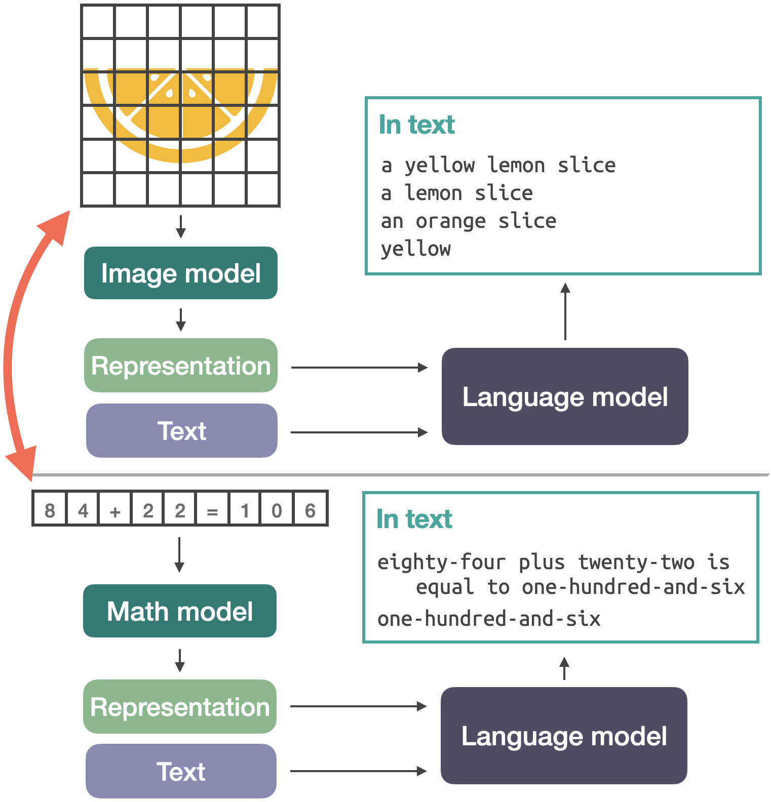

# Small multimodal models in a math-and-language domain 

Code for the (Dis)embodiment workshop 2022 paper "Can We Use Small Models to Investigate Multimodal Fusion Methods?" (TBD: provide link to article).

## Main files
* Information about how to run the experiments described in the paper can be found under [data/experiments.md](data/experiments.md). 
* Once the experiments have been run, the code used for generating the plots in the paper can be found under [data/results.ipynb](data/results.ipynb).

## Acknowledgements

We thank the authors behind [VOLTA](https://github.com/e-bug/volta) and [LXMERT](https://github.com/airsplay/lxmert) for providing well-structured code repositories describing their work.
